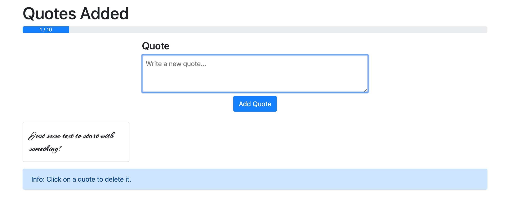

# Wonderful Quotes

This is the second course project of [this Udemy course on VueJS](https://www.udemy.com/vuejs-2-the-complete-guide) by Maximilian Schwarzmüller.
It's an opportunity to consolidate my understanding of VueJS components.
The goal is to create a page where you can enter up to 10 quotes that you create via an input field. Once they're created, they appear at the bottom of the page and you can click on them to erase them.

This project uses Vue CLI 3 and Bootstrap 4.



## Project setup

```
npm install
```

### Compiles and hot-reloads for development

```
npm run serve
```

### Compiles and minifies for production

```
npm run build
```
